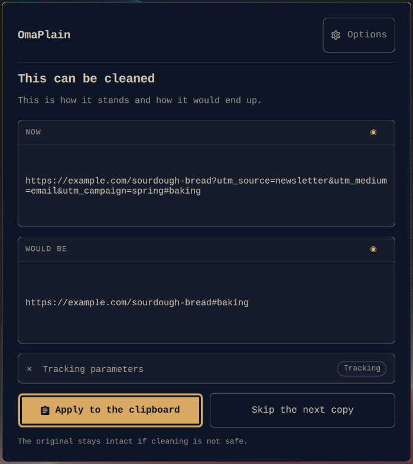
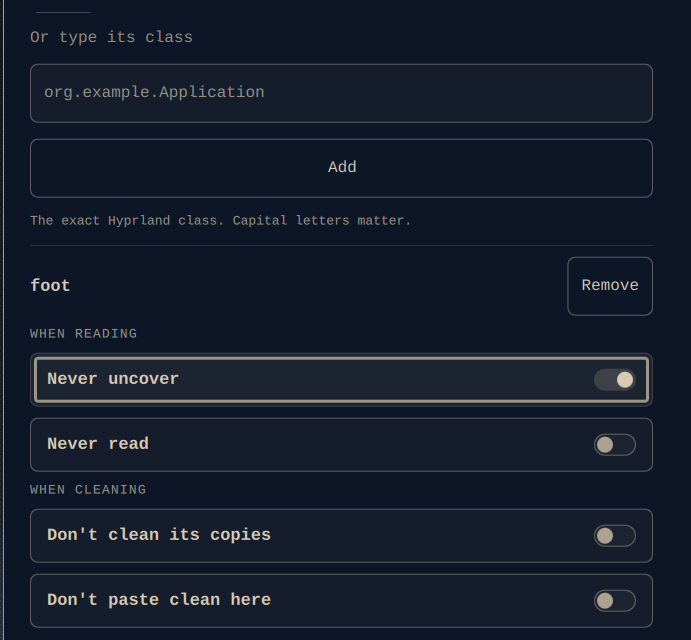
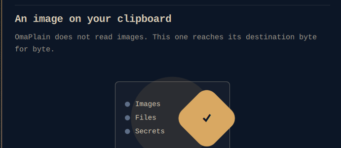

# OmaPlain

**Paste clean text by default. Keep everything else untouched.**



OmaPlain is an [Omarchy](https://omarchy.org) shell plugin. It watches the
Wayland clipboard and, when what you copied is plain text it can safely rewrite,
it strips the parts you did not mean to carry: rich formatting, tracking
parameters, mismatched line endings and a conservative set of invisible
characters.

Everything else it leaves exactly as it found it. It never touches images, files
or password-manager secrets, keeps no history of its own, makes no network
requests, and never claims a global shortcut. When in doubt it does nothing,
which is the only behaviour that is safe to run on every copy you make.

## Install

```sh
omarchy plugin add https://github.com/r-bart/omaplain.git --enable
```

Plugins run as unsandboxed code inside your long-lived shell process. Read the
source before you enable it — that advice is Omarchy's, and it is good advice.

To also get it in the application launcher, copy the desktop entry. It is not
installed for you, because a clipboard plugin that writes into your application
directories without saying so is doing the thing this project promises not to
do:

```sh
cp io.github.r-bart.omaplain.desktop ~/.local/share/applications/
```

**You need** Omarchy with `omarchy-shell` (developed against **4.0.0.alpha**),
`wl-copy` and `wl-paste`, `hyprctl`, Python **3.10+** (standard library only)
and `setpriv`. The plugin checks all of them at startup, and never installs
anything.

## Opening it

Three ways, and none of them turns itself on
([`0010`](docs/decisions/0010-como-se-abre-el-panel.md)):

**The bar icon.** The plugin declares a bar widget; placing it is yours to do,
in `bar.layout` in `~/.config/omarchy/shell.json`:

```json
{ "id": "io.github.r-bart.omaplain" }
```

Left click opens and closes it. Right click deliberately does nothing.

**The launcher.** Omarchy's Apps menu lists `.desktop` entries, so once you have
copied ours it is there under *OmaPlain*.

**The terminal**, which is what the other two call underneath:

```sh
omarchy-shell shell toggle io.github.r-bart.omaplain
```

If you want a global shortcut, add one to your own Hyprland config. OmaPlain
will not add it for you.

## The panel

The everyday screen shows what is on your clipboard and what OmaPlain would do
with it — before it does it, as in the screenshot above. Both rows arrive
covered; an eye reveals them, and every new copy comes back covered.

The whole panel is keyboard operable. A first run walks through a welcome, a
three-step tour and the settings, all replayable later from *Help and learning*.
Language follows your system locale and can be forced to English or Spanish.

## What it cleans

Four rules are on out of the box:

| Rule | What it removes |
|---|---|
| Rich formatting | Pastes the plain-text representation only |
| Link tracking | `utm_*` and friends, **only** when the clipboard is one whole URL. Signed links are left alone |
| Invisible characters | Zero-width and directional marks. Emoji, right-to-left writing and language marks stay |
| Line endings | `CRLF` and `CR` become `LF`, without dropping the final break |

Four more are available and off by default: straight quotes, list bullets,
Unicode NFC normalisation, and trailing whitespace.

## Per-application rules

Some applications should be treated differently, and OmaPlain lets you say so
one application at a time. Pick it from the windows you have open — the class
Hyprland reports is exactly what the daemon matches against — or type its class,
then choose any combination of four independent rules.



| | Rule | Effect |
|---|---|---|
| **When reading** | Never uncover | The panel shows that something is there, never what it says |
| | Never read | The daemon does not read the clipboard at all for copies from this app |
| **When cleaning** | Don't clean its copies | Text copied there passes through untouched |
| | Don't paste clean here | *Paste clean* does nothing in this window |

The four are independent on purpose: an app whose text should not be rewritten
is not necessarily an app whose text should not be seen.

**How far the promise reaches.** Wayland does not say who copied. The daemon
infers it from the focused window at the moment of the event, so this is a good
filter and not a security barrier — and the panel says so in those words. What
your system marks as sensitive is covered by a separate path that does not
depend on attribution at all.

## What it never does

For anything it will not rewrite, the panel tells you what you have and why it
is being left alone:



- **It never touches images, files or structured formats.** For an image it does
  not even read the clipboard.
- **It never rewrites a copy your password manager marked as sensitive**, and
  never shows it on screen.
- **It keeps no history.** The clipboard history you already have belongs to
  Omarchy, and OmaPlain neither reads nor extends it.
- **It never modifies your Hyprland configuration** and never claims a global
  shortcut. `Super+V` and `Super+Ctrl+V` stay Omarchy's.
- **It never sends anything anywhere.** No network requests, no analytics.
- **It never installs packages** and never asks for `sudo`.

## From the command line

```sh
omarchy-shell omaplain cleanNow        # clean what is on the clipboard now
omarchy-shell omaplain pasteClean      # clean, then paste into the focused window
omarchy-shell omaplain skipNext        # leave the next copy alone for 60 s
omarchy-shell omaplain setAutomatic false
omarchy-shell omaplain reload
omarchy-shell omaplain status
```

Actions are asynchronous: the call returns `accepted`, and the sanitised result
shows up in the panel and in `status`. **No response ever contains copied
text.**

A global shortcut of your own can call `pasteClean`.

## How it stays safe

The flow is deliberately conservative:

```text
Wayland event
  → classify state and MIME types
  → bypass if sensitive, image, file or structured
  → read at most 1 MiB of text/plain
  → transform and check invariants
  → verify the clipboard has not changed underneath
  → at most one text/plain UTF-8 rewrite
```

The daemon serialises events, uses monotonic generations, compares before
writing, and recognises its own rewrite through an in-memory hash that never
touches disk. Quickshell only supervises the process; it never receives the
content.

Session files live in `$XDG_RUNTIME_DIR/omaplain/` with `0700` on the directory
and `0600` on the config, state and socket. Copied text is not persisted in any
of them.

## Known limits

- When a transformation changes characters, **Omarchy's own history may keep
  both versions** until you clear it. Turn off tracking/invisible removal, or
  use `pasteClean`, if you want an explicit action instead.
- A password copied without `CLIPBOARD_STATE=sensitive` and without a password
  manager MIME type is indistinguishable from ordinary text. Give that
  application a *never read* rule if it does not mark its secrets.
- Source attribution is best effort on Wayland (see above). MIME types and the
  sensitivity flag are the safety gates; the application class is not.
- LibreOffice announces structured formats even alongside ordinary text, so it
  is bypassed conservatively.
- The primary selection is not processed, and devices are never synchronised.
- Initial support targets the default seat.

The [compatibility matrix](docs/COMPATIBILITY.md) has the per-application
detail.

## Privacy

No network requests, no analytics, nothing stored. Omarchy's own clipboard
manager may keep text in its history exactly as it did before you installed
this, and that persistence belongs to Omarchy.

To report a vulnerability, follow [SECURITY.md](SECURITY.md) — and please do not
put real clipboard content in the report.

## Development

```sh
tests/run.sh
```

Unit and property tests, a benchmark, an accelerated soak of 28,800 events, and
Omarchy's own plugin validator. The validator and `qmllint` need Omarchy
installed; everything else runs anywhere and runs in CI.

After editing any `.qml`, restart the shell:

```sh
omarchy restart shell
```

`omarchy-shell shell rescanPlugins` is not enough. It re-reads the plugin
registry, but Qt keeps the QML it already compiled for that URL, so the panel
keeps showing the previous version **without reporting any error**.

Architecture lives in [SPEC.md](SPEC.md). Every product and design decision is
written down and argued in [docs/decisions](docs/decisions) — read those before
proposing a change; several of them exist to record what was deliberately
rejected and why.

## Licence

Code under [GPL-3.0-or-later](LICENSE). The rule tables written for this project
are offered under CC0-1.0; see [ATTRIBUTIONS.md](ATTRIBUTIONS.md).
